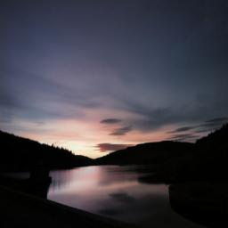

# Colorize
For my onboarding project at Brown Visual Computing, I decided to take a crack at creating a deep learning model to colorize black and white photos. There is a lot of prior work on this topic, which I turn to from time to time for guidance, but this was mostly for me to explore the process of tackling an interesting ML problem without relying on existing solutions. 

## Data
To train our models, we needed a collection of colored images. Instead of using common image classification benchmarks like ImageNet, I wanted higher quality images that would make for good presentation. Therefore, I used the [Unsplash Lite dataset](https://github.com/unsplash/datasets), a collection of 25,000 images from [Unsplash](unsplash.com), a website where photographers upload their work for free public use. The download and processing script is on the top of [a Jupyter notebook](https://github.com/alexander-ding/colorize/blob/main/colorize.ipynb). We used 15,000 images for training, 5,000 for validation, and 5,000 for testing. 

Some example photos:

In addition, I employed data augmentation to create a robust training dataset. Specifically, we applied random crops and horizontal flips to the training dataset when sampling. 

### LAB vs RGB
One important improvement we make to simplify the issue is to represent colored images in [LAB color space](https://en.wikipedia.org/wiki/CIELAB_color_space). By expressing colors in three values--L* (perceptual lightness), a* (green/red), and b* (blue/yellow)--, LAB separates the black and white part of an image into a single channel, L*, and it leaves the task of coloring entirely to a* and b*. This allows us to frame the problem as: given a black and white image of size 1xHxW, representing the L* channel, generate a 2xHxW array, representing the a* and b* channels, to fill in the colors. We then combine the 3 channels and convert the result into RGB for regular image encoding. Data is normalized to the range of [-1, 1].

Our [dataloader](https://github.com/alexander-ding/colorize/blob/main/colorize/datasets/ColorizeDataset.py) implements the logic of loading JPGs, converting them into LAB, and separating out the channels into inputs and outputs. 

## Architectures
### First attempt
The first thing that came to me was an autoencoder architecture. We need a model that does image-to-image translation, and we can take advantage of lower-level semantic features extracted by pretrained CNNs to inform the upsampling layers about which colors to pick. Specifically, I started with a pretrained Resnet50, extracted mid-level features (256x56x56 in size), and upsampled from these features to create a 2x224x224 output that corresponds to the a* and b* channels. The model is defined [here](https://github.com/alexander-ding/colorize/blob/main/colorize/models/ResnetAutoEncoder.py). 

Another important decision was the choice of loss function. For a first attempt, I simply used mean-squared-error (MSE) to calculate per-pixel differences between the predicted output and the desired output. 

For training, I used the Adam optimizer with learning rate set to 0.001 and early stopping enabled based on validation loss (with patience 3). After 20 epochs of training, the results are as follow (left=black and white, middle=model-predicted, right=ground truth):

As can be seen, the results are poor. Most attempts at recolorization heavily use brown-ish colors and rarely ventures into more vibrant color spaces. This is because brown is the average color in the space of our training photos, and the model learns to "cheat" by conservatively coloring using the average color as a heuristic to minimize the loss function. The model is punished much more when it uses vibrant colors than when it uses dull colors due to the nature of our loss function. To illustrate the point, the loss of a model that blindly colors everything brown is much smaller than the loss of a model that randomly generates colorings distributed between [-1, 1]. Our model only slightly outperforms the model that colors everything brown, meaning that it has learned very little about coloring based on context. 

Despite this, there are some signs that the model is learning context-specific coloring. The first, third, fifth, and last rows of the previous image show the model using a dull blue color to fill in for what seems like the sky. By manually combing through the model's recolorization of the test dataset, we can find a few convincing attempts (left=model, right=ground truth). 

The second example clearly indicates an attempt to separate the sky out from the foreground and coloring it as blue. 

### Second Attempt
Now it's time to iterate on the first model. The first limitation it has is that the upsampling process only had access to one layer of mid-level extracted features. It contains some higher level semantic information about the image, but it is at the cost of spatial resolution available in the original image. Therefore, the model might have struggled to get enough information about the image's features at every pixel and therefore fails to do more better after the initial "find the average" stage. Therefore, my solution was to switch to a fully-convolutional network (FCN), which combines information from every level of the backbone network, from the lowest level, which contains the most spatial information, to the highest level, which contains the most abstract semantic information. I expected the model to be able to color with more nuance based on the smenatic information it extracts from the image. 

The model is defined [here](https://github.com/alexander-ding/colorize/blob/main/colorize/models/ResnetFCN.py), using a Resnet101 backbone pretrained on ImageNet. 

I trained this new model with the same setup as the first attempt for 20 epochs. The results are as follow (left=black and white, middle=model-predicted, right=ground truth):

As we can see, the results are somewhat better. More images show a clear effort at using more varied colors. We can see shades of blue for sky (row 1, 2, 4), yellow for light (row 4), and green for tree (row 1, 5, 6, 15) that either do not exist in the previous attempts or are more prominent than the previous attempts.

The same examples that have worked well for the first model show similar improvements, as shown below (left=first attempt, middle=second attempt, right=ground truth):

  

  

The second row's color of the sky is somewhat more vibrant, and it shows much less of the patchy transition between the background and the foreground. 

However, the second model still suffers from the same issues as the first model, using dull colors and failing to produce convincing results most of the time. 

### Third Attempt
After reviewing the previous methodology and doing some research online, I realized that the biggest issue was the loss function. MSE encouraged average brown-ish colors with how the math worked out, and other people also struggled to produce good results with MSE. There were some interesting alternative handcrafted loss functions that encouraged more vibrant colors, as discussed in [Colorful Image Colorization](https://arxiv.org/abs/1603.08511) by Zhang et al. However, a more robust solution was to dynamically adapt the loss function using an generative adversarial network (GAN). There has been successful prior work using this approach that achieved state-of-the-art performance, such as [pix2pix](https://github.com/phillipi/pix2pix) and [DeOldify](https://github.com/jantic/DeOldify), and the goal of our third attempt is to replicate their work and achieve significantly better results. 

A GAN has two models, a generator and a discriminator. In our case, the generator takes in the black and white image and attempts to generate a convincing coloring, and the discriminator is trained to tell apart real colored images and fake ones generated by the generator. Instead of only judging the generator based on its outputs' similarity to the ground truth, we also include an additional part of its loss based on how well it can deceive the discriminator. We alternate between training the generator and the discriminator, so that as the generator gets better at fooling the discriminator, the discriminator also figures out new ways the generator is unconvincing. Ultimamtely, the discriminator serves to dynamically modify the loss function to punish any sort of cheating behavior from the generator that might score well with the fixed MSE loss but result in unconvincing results. 

The overall idea of our generator's architecture is very similar to our second attempt, except we use a [UNet](https://arxiv.org/pdf/1505.04597.pdf) instead of a FCN. UNets are an iteration inspired by FCNs to improve performance by having more sophisicated connections between the different levels of features (instead of adding them together like FCN does). The discriminator is a straight-forward convolutional neural network that determines if each section of an image seems generated or real. The full model is defined [here](colorize/models/UNetGan.py). 

We trained the model for 100 epochs with learning rate 0.0002 for both the generator and discriminator, initializing the weights with mean 0 and standard deviation 0.02. 

Before we proceed further, let's look at some of our GAN's attempts at recolorization:

Pretty amazing, right? Our model is finally willing to use a much wider range of colors, and the coloring of many of these images look very convincing. While we can see some of the same issues as the previous models--a tendency to use brown-ish coloring and relative lack of contrast that lead to the photos looking faded--, the results are much improved. 

Here are the same side-by-side comparisons as before (left=black and white, middle=model-predicted, right=ground truth):

An interesting property to observe is that the GAN is focused much more on generating a convincing colorization than replicating the original colorization completely. This is due to our new loss function, which combines both how well the model can replicate the original colors *and* how well the model can fool the discriminator. At the end of the day, recolorization is an "impossible" task to get completely right, since black and white images fundamentally fail to contain enough information to fully inform a reconstruction, and the model has to hallucinate the colors. Therefore, success of a recolorization model isn't so much about perfect color recreation, but about creating something convincing to the human eyes. To drive home the point, let's look at another set of side-by-side:

Without scrolling up, which is the ground truth, and which is model-generated?
 

  
Answer

  
  For the first row, the left one is the ground truth. For the second row, the right one is the ground truth.   
  I hope our GAN managed to trick you! The point is: if we can't tell, does it really matter?

## Next Steps

Due to time constraints, I didn't have time to fully explore everything pix2pix and DeOldify did to make their results so amazing. I'll discuss a few such potential improvements here.

First, we could have used a pretrained backbone for our UNet. As it is, our generator needs to learn from scratch how to parse and understand the input images, but using a pretrained backbone would allow us to benefit from the feature extraction abilities of a model trained on the entire ImageNet, which our current dataset cannot effectively provide. This would lead to much better generalization to images outside the current domain of our dataset. 

Second, we could have pretrained our generator on only recolorization (instead of both recolorization and fooling the adversarial discriminator) until the generator gets pretty good at recolorization before we begin training the whole GAN with the setup we have used in attempt 3. This allows our discriminator to quickly reach a point of competence and stabalize the whole training process. Likewise, we could also pretrain the discriminator on the pretrained generator before engaging in GAN training. This serves a similar purpose.

Finally, we could swap out the GAN with a [self-attention GAN](https://arxiv.org/abs/1805.08318) to improve the overall performance of our model. 

All in all, this was a very valuable learning experience. I hope you enjoyed reading this write-up and learned something as well! 

## References
1. https://emilwallner.medium.com/colorize-b-w-photos-with-a-100-line-neural-network-53d9b4449f8d
2. https://github.com/phillipi/pix2pix
3. https://towardsdatascience.com/colorizing-black-white-images-with-UNet-and-conditional-gan-a-tutorial-81b2df111cd8
4. https://github.com/jantic/DeOldify
